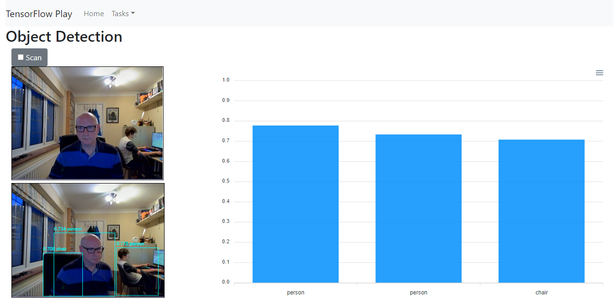
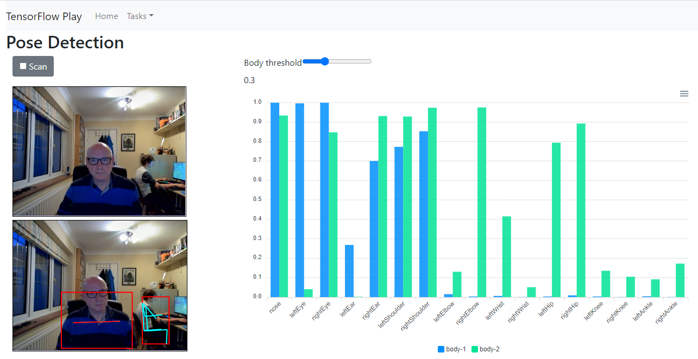

# TensorFlow UI

This project was created with [Create React App](https://github.com/facebook/create-react-app).

## Building

To build:
```bash
npm install
```

## Running

To run:
```bash
npm start
```

This runs the app in the development mode.\
Open [http://localhost:3000](http://localhost:3000) to view it in the browser.

The page will reload if you make edits.\
You will also see any lint errors in the console.

## Screenshots

Object Detection


Pose Detection


## TensorFlow Models
Much of the code is taken from the TensorFlow demo models:

- [Object Detection](https://github.com/tensorflow/tfjs-models/tree/master/coco-ssd)
- [Body Pix (Legacy)](https://github.com/tensorflow/tfjs-models/tree/master/body-pix)
- [Pose Detection](https://github.com/tensorflow/tfjs-models/tree/master/posenet)
- [Image Classification](https://github.com/tensorflow/tfjs-models/tree/master/mobilenet)
- [Face Landmarks Detection](https://github.com/tensorflow/tfjs-models/tree/master/face-landmarks-detection)
- [Hand Detection](https://github.com/tensorflow/tfjs-models/tree/master/handpose)
- [Hand Pose Detection](https://github.com/tensorflow/tfjs-models/tree/master/hand-pose-detection)


